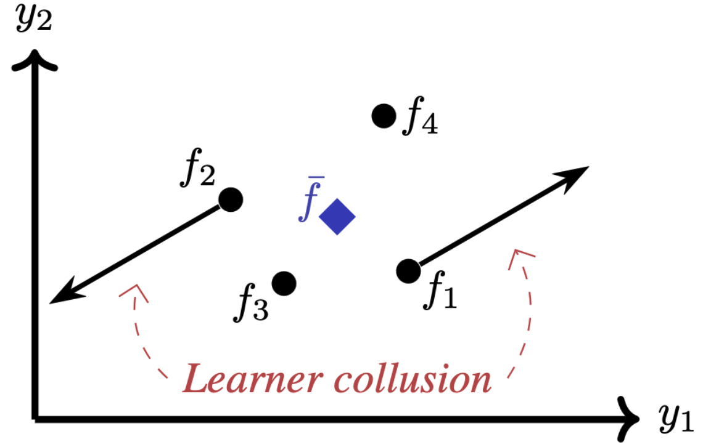

<div align="center">

## Joint Training of Deep Ensembles Fails Due to Learner Collusion
</div>

<p align="center">

</p>

This repository contains the code associated with [our NeurIPS 2023 paper](https://arxiv.org/abs/2301.11323) titled "Joint Training of Deep Ensembles Fails Due to Learner Collusion". This work investigates why training deep ensembles *jointly* results in degenerate behavior. For further details, please see our paper. In this repository, we include the code to reproduce the image-based experiments from the paper. 


### Experiments
**Setup**

Clone this repository and navigate to the root folder.
```
git clone https://github.com/alanjeffares/joint-ensembles.git
cd joint-ensembles
```
Ensure PYTHONPATH is also set to the root folder.
```
export PYTHONPATH="/your/path/to/joint-ensembles"
```
Using conda, create and activate a new environment. 
```
conda create -n <environment name> pip python
conda activate <environment name>
```
Then install the repository requirements.
```
pip install -r requirements.txt
```

Then the experiements are split across two files. `src/sweep.py` runs the experiments that sweep across values of $\beta$ from the augmented objective in Sec. 5. `src/imagenet.py` runs the ImageNet experiments reported in Table 1. 

**Sweep**

Set the path to the folder in which the data is stored (or should be downloaded to) in `src/configs/data.json`.

Next, select the configuration of experiment. The high-level experimental parameters are set in `src/configs/sweep/experiment.json` and the more fine-grained optimization hyperparameters are set in `src/configs/sweep/optim.json`. The values implemented for the arguments that the user might wish to change are listed in `src/tests/implemented.json`.

Once the configs are set, the experiment can be run with the following command (where `<tag>` is an optional keyword to save the experiment under).
```
python src/sweep.py <tag>
```
After the experiment is complete the results can be found in the `results/` foder.

**ImageNet**

Download and process the ImageNet data following the instructions from [this blog post](https://towardsdatascience.com/downloading-and-using-the-imagenet-dataset-with-pytorch-f0908437c4be). Then set the path to the folder in which the data is stored in `src/configs/data.json`.

Next, select the configuration of experiment. The high-level experimental parameters are set in `src/configs/imagenet/experiment.json` and the more fine-grained optimization hyperparameters are set in `src/configs/imagenet/optim.json`. The values implemented for the arguments that the user might wish to change are listed in [`src/tests/implemented.json`](https://github.com/alanjeffares/joint-ensembles/blob/master/src/tests/implemented.json).

Once the configs are set, the experiment can be run with the following command (where `<tag>` is an optional keyword to save the experiment under).
```
python src/imagenet.py <tag>
```
After the experiment is complete the results can be found in the `results/` foder.

### Citation

If you use this code, please cite the associated paper.

```
@article{jeffares2023joint,
  title={Joint Training of Deep Ensembles Fails Due to Learner Collusion},
  author={Jeffares, Alan and Liu, Tennison and Crabb{\'e}, Jonathan and van der Schaar, Mihaela},
  journal={arXiv preprint arXiv:2301.11323},
  year={2023}
}
```
